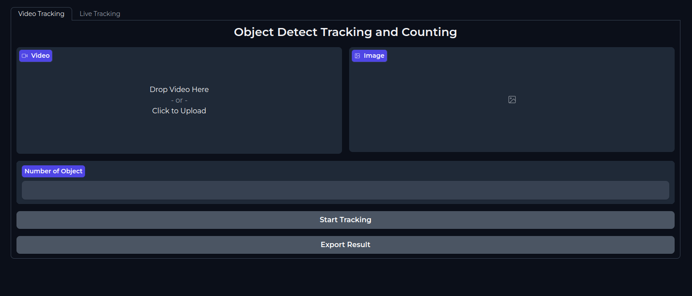
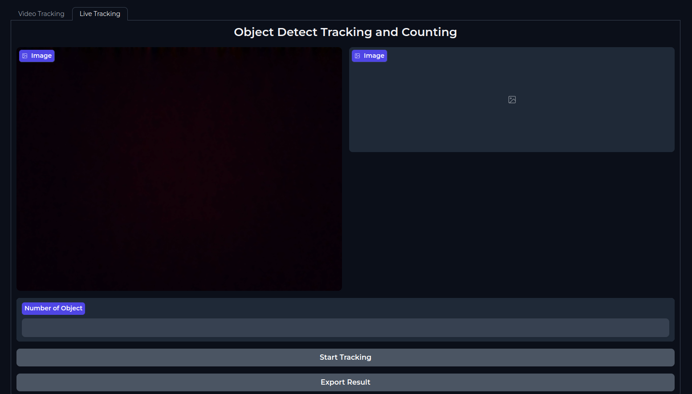

# Object Detection, Counting amd Tracking
User interface for live and recorded video

### Conda Environment
```bash 
conda create -n <nameofenvironment>
conda activate <nameofenvironment>
```
## Run user interface
```bash
git clone https://github.com/Drwaish/objectcounting
cd objectcountng
```
## Install Requirements
```bash
pip install -r requirements.txt
```

# Run Gradio APP
If you want to use interface for recorded video and live tracking run main.py
```bash
python3 main.py
OR
python main.py

```
### Video Interface 


### live interface


# Run FLASK API
If you want to run flask api. Run server.py
```
python3 server.py
OR
python server.py
```
### Payload
For Video
```
{
video : <video>
}
```
Expected Response without error
```
{
'Download link': link ,
'status' : 'Ok'
}
```
For image
```
{
    image : <image>
}
```
Expected Response without error
```
{
'Download link': link ,
'type' : 'jpg'
}
```
# Example Videos
<p>
 <video width="320" height="240" controls>
  <source src="assets/traffic.mp4" type="video/mp4"> &nbsp:&nbsp:&nbsp
</video> 
 <video width="320" height="240" controls>
<source src="assets/output(7).mp4" type="video/mp4"> 
</video>
</p>


